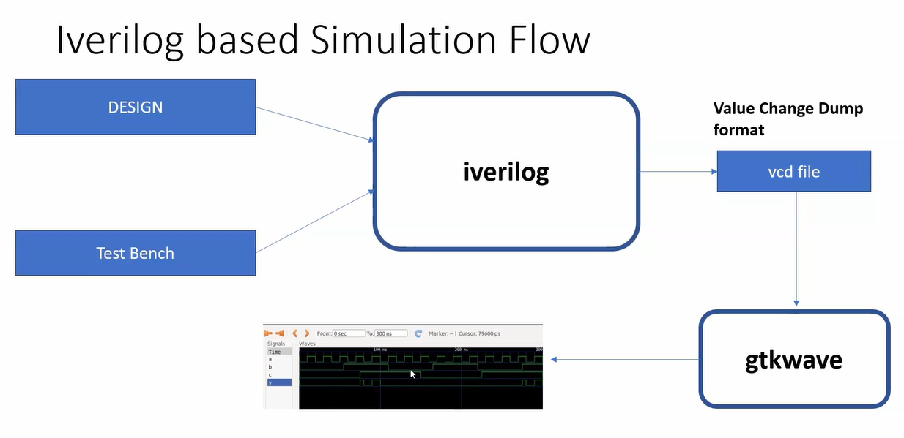
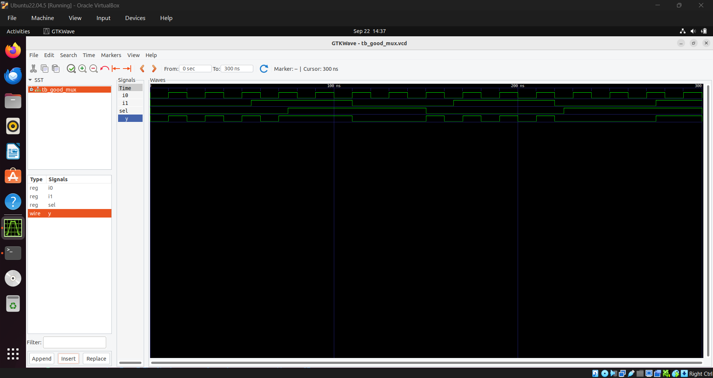
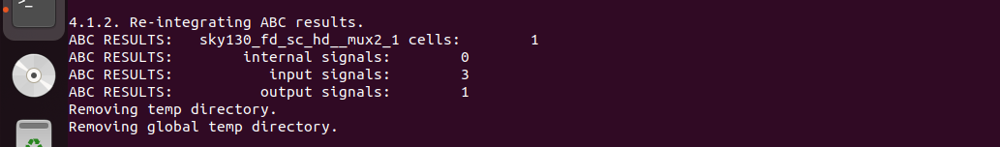
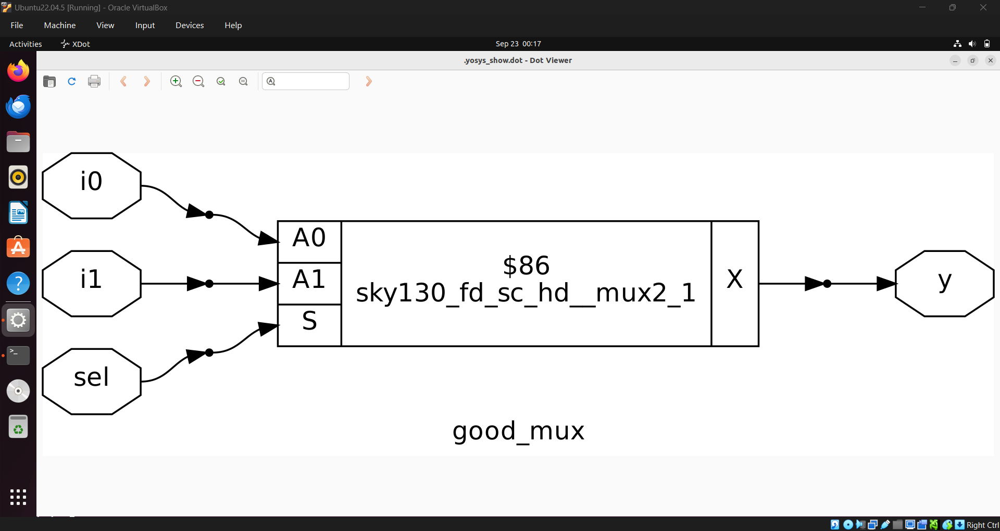

# Day 1 

## 1. HDL Design, Simulatior and Testbench

### **1. HDL Design**
HDL design is the description of the hardware logic intended to realize in either a Hardware Description Language such as System Verilog or VHDL.

### **2. Simulatior**
Simulator is the tool used to check the functionality and behaviour of the Hardware implemented through the HDL design. This is done by supplying some set of predescribed inputs into the design and observing the corresponding outputs.

### **3. Testbench**
Testbench is a file that is used to supply a set of input values to the design with whatever timings as we want observe. Testbench file together with the Simulator is used to verify the functionality of the design. In this RISC-V SoC tapeout program, the simulatior used wil be Icarus Verilog, which is an open source simulator.

## 2. Iverilog based simulation flow
Design and testbench is provided to the iverilog simulatior. A .vcd (Value Change Dump) file is generated by the iverlog simulator. The .vcd file can be used to observe the associated waveforms using gtkwave.




## 3. Simulating a 2 to 1 Multiplexer

Step 1. Go to the directory with the testbench and design files
```
$ cd vsd_risc_v_prog/sky130RTLDesignAndSynthesisWorkshop/verilog_files
```
Step 2. Compile the design and testbench
```
$ iverilog  good_mux.v tb_good_mux.v
```
Step 3. Run the simulation
```
$ ./a.out
```
Step 4. Observe the waveform in gtkwave
```
$ gtkwave tb_good_mux.vcd
```
Observing waveform through gtkwave


## 4. Introduction to Yosys & Gate Libraries

 - Used to convert RTL to netlist (which is the design implemented as collection of standard cells).

### What is .lib file?
 - Collection of basic logical modules, which are the standard cells (AND, OR, NOR...).
 - Different versions of same logical module:
     Each of these versions differ in speed, area, power comsumption etc. While some versions are used in order to make hardware that operates at higher frequency (at the cost of area and power consumption), the slower versions are necessary in cases where area or power consumption are the bottleneck.


## .5 Synthesizing design with Yosys

Step 1. Invoke Yosys (I invoked yosys from the directory where the verilog files are present)
```
$ yosys                  
```
Step 2. Read the liberty library (have to give path to the library files, relative or absolute)
```
$ read_liberty -lib ../lib/sky130_fd_sc_hd__tt_025C_1v80.lib
```
Step 3. Read the verilog code (as I am already in the directory where verilog modules are present, no adding any path)
```
$ read_verilog good_mux.v
```
Step 4. Synthesize the design ( we are synthesizing the top module which is "good_mux")
```
$ synth -top good_mux
```

Step 5. Generating the netlist
```
$ abc -liberty ../lib/sky130_fd_sc_hd__tt_025C_1v80.lib
```
The standard cell used to make the netlist can be seen:


Step 6. To view the netlist
```
$ show
```
The generated netlist:



Observing waveform through gtkwave

