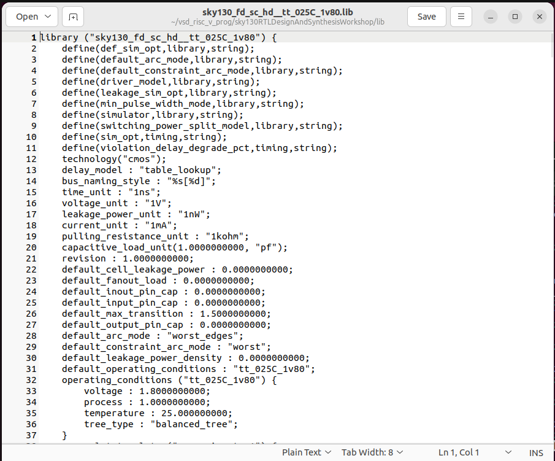
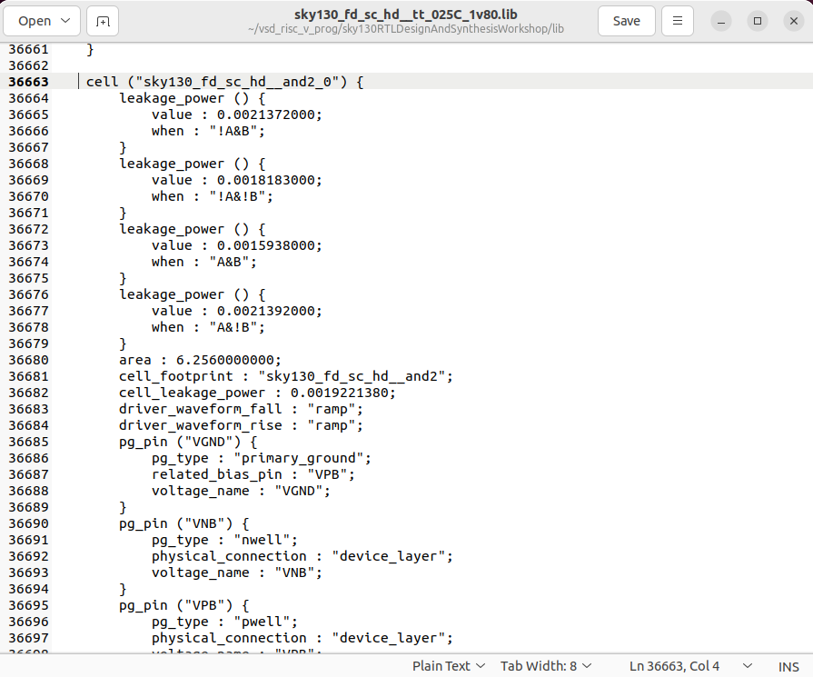
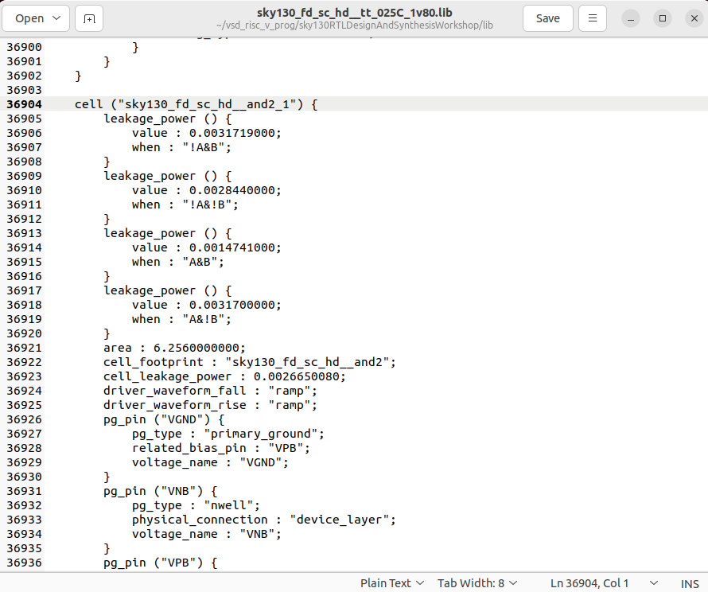
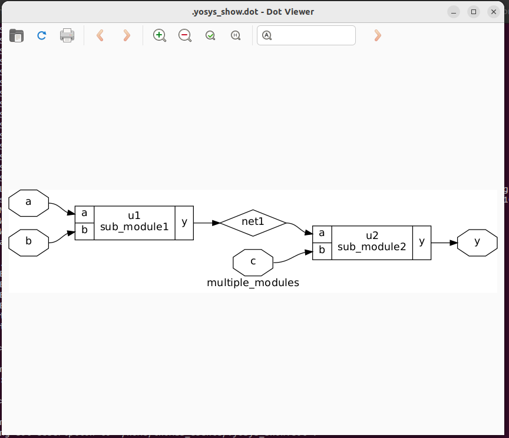
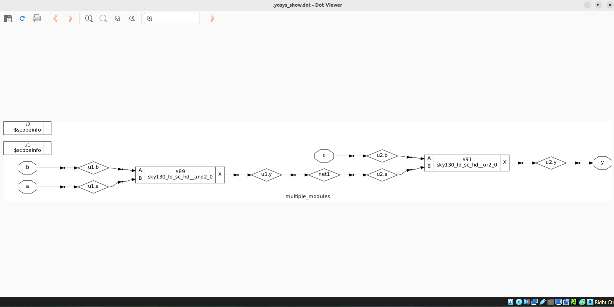

# Day 2

## 1. Understanding .lib file

### **1. Timing libraries**
The .lib file here corresponds to the Process Design Kit (PDK) used in the program. The PDK used here is the SKY130 PDK which is an open-source PDK based SkyWater Technology's 130 nm CMOS technology. These files contain the all standard cells used to realize our complex designs, along with other specs such as power consumption, area, timing etc.  

### **2. Undertanding the library filename**
The three important parameters regarding a device are:
 - Process
 - Voltage
 - Temperature
   
The .lib files are prepared for different cases of the above parameter. In our case the library used is:
### sky130_fd_sc_hd__tt_025C_1v80.lib 
 
Here the "tt_025c_1v80" part indicates the process, temperature and voltage parameters:
 - tt: Typical process corner.
 - 025C: the temparature range specified for this process is 25 degree celsius.
 -  1v80: the working voltage is 1.8V.


## 2. Exploring the .lib file
The sky130_fd_sc_hd__tt_025C_1v80.lib can be opened in some text editor. Here "gedit" is used:
```
$ gedit sky130_fd_sc_hd__tt_025C_1v80.lib 
```




### Different versions of same logic

Here I have shown the two versions of 2 input and standard cells:
<div align="center">
  
  
</div>

Here it can be observed that the first cell has a leakage power less than that of the second one. This shows that the second cell is a faster version compared to the second one. It can be also seen that in the upcoming line of cell definition the first one will be have a lesser area than the second cell.

## 3. Hierarchical vs. Flattened Synthesis

When there are multiple modules involved in design there are two options of synthesizing the design
 - Hierarchical
 - Flattened

Here we us multiple_modules.v to demonstrate this

1. Heirarchical synthesis

The default synthesis generates heirarchical netlist

```
$ synth -top multiple_modules
```



Netlist generated during Heirarchical synthesis:
```
module multiple_modules(a, b, c, y);
  input a;
  input b;
  input c;
  wire net1;
  output y;
  sub_module1 u1 (
    .a(a),
    .b(b),
    .y(net1)
  );
  sub_module2 u2 (
    .a(net1),
    .b(c),
    .y(y)
  );
endmodule

module sub_module1(a, b, y);
  wire _0_;
  wire _1_;
  wire _2_;
  input a;
  input b;
  output y;
  sky130_fd_sc_hd__and2_2 _3_ (
    .A(_0_),
    .B(_1_),
    .X(_2_)
  );
  assign _0_ = b;
  assign _1_ = a;
  assign y = _2_;
endmodule

module sub_module2(a, b, y);
  wire _0_;
  wire _1_;
  wire _2_;
  wire _3_;
  wire _4_;
  input a;
  input b;
  output y;
  sky130_fd_sc_hd__clkinv_1 _5_ (
    .A(_0_),
    .Y(_3_)
  );
  sky130_fd_sc_hd__clkinv_1 _6_ (
    .A(_1_),
    .Y(_4_)
  );
  sky130_fd_sc_hd__nand2_1 _7_ (
    .A(_3_),
    .B(_4_),
    .Y(_2_)
  );
  assign _0_ = b;
  assign _1_ = a;
  assign y = _2_;
endmodule

```

2. Flattened synthesis

Inorder to convert the previously generated netlist to flattened mode:
```
$ flatten
```

Netlist corresponding to the flattened synthesis:


```
/* Generated by Yosys 0.7 (git sha1 61f6811, gcc 6.2.0-11ubuntu1 -O2 -fdebug-prefix-map=/build/yosys-OIL3SR/yosys-0.7=. -fstack-protector-strong -fPIC -Os) */

module multiple_modules(a, b, c, y);
  wire _00_;
  wire _01_;
  wire _02_;
  wire _03_;
  wire _04_;
  wire _05_;
  wire _06_;
  wire _07_;
  input a;
  input b;
  input c;
  wire net1;
  wire \u1.a ;
  wire \u1.b ;
  wire \u1.y ;
  wire \u2.a ;
  wire \u2.b ;
  wire \u2.y ;
  output y;
  sky130_fd_sc_hd__and2_2 _08_ (
    .A(_00_),
    .B(_01_),
    .X(_02_)
  );
  sky130_fd_sc_hd__clkinv_1 _09_ (
    .A(_03_),
    .Y(_06_)
  );
  sky130_fd_sc_hd__clkinv_1 _10_ (
    .A(_04_),
    .Y(_07_)
  );
  sky130_fd_sc_hd__nand2_1 _11_ (
    .A(_06_),
    .B(_07_),
    .Y(_05_)
  );
  assign \u1.a  = a;
  assign \u1.b  = b;
  assign net1 = \u1.y ;
  assign _00_ = \u1.b ;
  assign _01_ = \u1.a ;
  assign \u1.y  = _02_;
  assign \u2.a  = net1;
  assign \u2.b  = c;
  assign y = \u2.y ;
  assign _03_ = \u2.b ;
  assign _04_ = \u2.a ;
  assign \u2.y  = _05_;
endmodule

```

In this netlist there are no instantiation of submodule. The top module is build directly from the standard cells.


For synthesising submodules:
```
synth -top submodule1
```
Here "submodule1" was one of the submodule in the main module "multiple_modules"

## 4. Introduction to Yosys & Gate Libraries

 - Used to convert RTL to netlist (which is the design implemented as collection of standard cells).

### What is .lib file?
 - Collection of basic logical modules, which are the standard cells (AND, OR, NOR...).
 - Different versions of same logical module:
     Each of these versions differ in speed, area, power comsumption etc. While some versions are used in order to make hardware that operates at higher frequency (at the cost of area and power consumption), the slower versions are necessary in cases where area or power consumption are the bottleneck.


## .5 Synthesizing design with Yosys

Step 1. Invoke Yosys (I invoked yosys from the directory where the verilog files are present):
```
$ yosys                  
```
Step 2. Read the liberty library (have to give path to the library files, relative or absolute):
```
$ read_liberty -lib ../lib/sky130_fd_sc_hd__tt_025C_1v80.lib
```
Step 3. Read the verilog code (as I am already in the directory where verilog modules are present, no adding any path):
```
$ read_verilog good_mux.v
```
Step 4. Synthesize the design ( we are synthesizing the top module which is "good_mux"):
```
$ synth -top good_mux
```

Step 5. Generating the netlist:
```
$ abc -liberty ../lib/sky130_fd_sc_hd__tt_025C_1v80.lib
```
The standard cell used to make the netlist can be seen:


Step 6. To view the netlist:
```
$ show
```
The generated netlist:


Step 7. Writing the netlist:
```
$ write_verilog -noattr good_mux_netlist.v
```
This will generate the verilog code for the same "good_mux.v" module, but in terms of standard cell from the library. The generated .v file:
```
/* Generated by Yosys 0.57+153 (git sha1 6b3a7e244, g++ 11.4.0-1ubuntu1~22.04.2 -fPIC -O3) */

module good_mux(i0, i1, sel, y);
  input i0;
  wire i0;
  input i1;
  wire i1;
  input sel;
  wire sel;
  output y;
  wire y;
  wire _0_;
  wire _1_;
  wire _2_;
  wire _3_;
  sky130_fd_sc_hd__mux2_1 _4_ (
    .A0(_0_),
    .A1(_1_),
    .S(_2_),
    .X(_3_)
  );
  assign _0_ = i0;
  assign _1_ = i1;
  assign _2_ = sel;
  assign y = _3_;
endmodule

```
