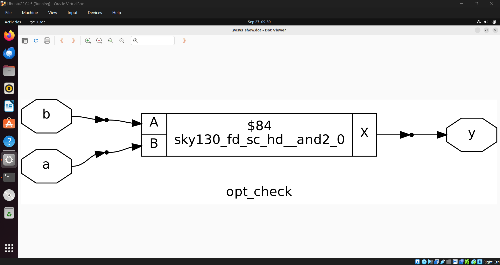
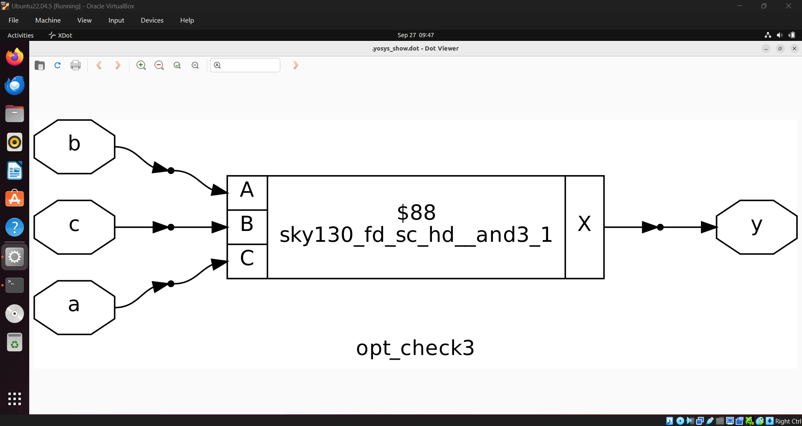
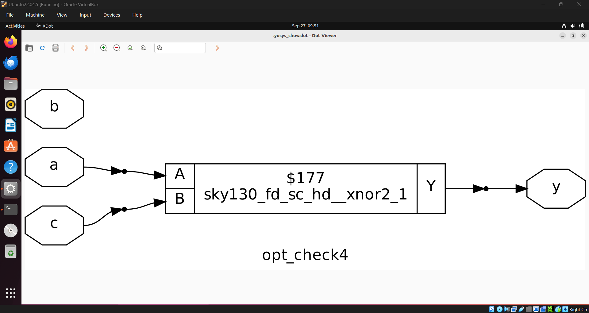
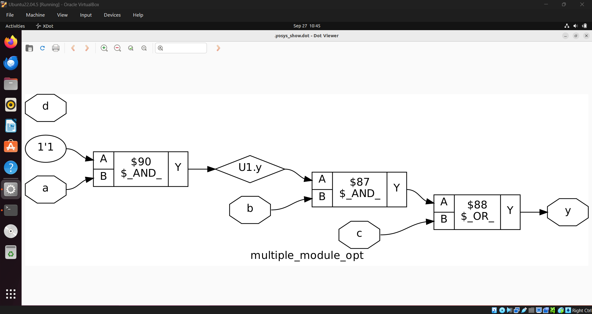
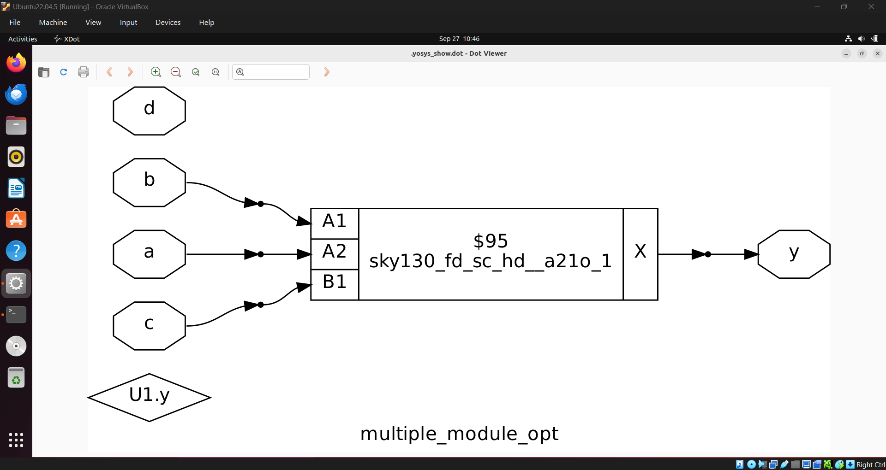
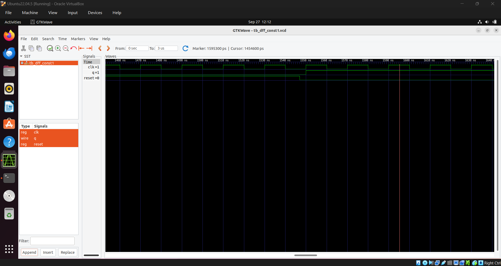

# Day 3
---
## 1. Different Optimization Methods
### 1. Combinatonal Logic Opitmizations

Combinational logic is squeezed in order so as to save area and power consumption. Different methods of combibnational logic optimization are:

#### 1. Constant Propagation 
 - If a variable is taking some value, then that value is propagted through the design to see what all changes it bring. Finally we get a reduced hardware.

#### 2. Boolean Logic Optimization 
 - The boolean logic associated with the hardware can be converted to reduced form.
   
---

### 2. Sequential Logic Optimization

#### Sequential Constant Propagation
 - If the output of a Flip-Flop is turning out to be a constant, due to some constraints in input or set/reset pin, this constant can be propagated through design and the design can be simplified.

##### Other Methods:
 - State Optimization: Simplifying the design if there are unsued states involved in the design.
 - Cloning: Duplicate logical cells and redistribute connections to balance load.
 - Retiming: Moving combinational logic sections across registers in such a way that overall functionality is not changed. This can reduce the delay between flip-flops and can increase the effective frequency.

---

## 2. Labs on optimization
### Lab1

Module for Lab1:
```verilog
module opt_check (input a , input b , output y);
	assign y = a?b:0;
endmodule
```
Explanation:
 - The output ```y``` is equal to input ```b``` when input ```a``` is high, else it is 0.
 - Here the logic can simplified as ```y=a AND b```.

Do synthesis with yosys as done before. For optimizing execute this command after ```synth -top opt_check```:
```
 $ opt_clean -purge
```



---

### Lab2
Module for Lab2:
```verilog
module opt_check2 (input a , input b , output y);
	assign y = a?1:b;
endmodule

```
Explanation:
 - The output ```y``` is equal to input ```1``` when input ```a``` is high, else it is equal to input ```b```.
 - Here the logic can simplified as ```y=a + a'.b = a + b```  which is just OR operation between a and b.


### Lab3
Module for Lab3:
```verilog
module opt_check3 (input a , input b, input c , output y);
	assign y = a?(c?b:0):0;
endmodule

```
Explanation:
 - Here is a two mux case. Output from inner mux can be written as ```c.b + c'.0 = c.b```. This is given to the outer mux which give the equation ``` y = c.b.a + 0.a' = a.b.c```
 - The output can be simplified as a 3 input AND gate.




### Lab4
Module for Lab4:
```verilog
module opt_check4 (input a , input b , input c , output y);
 assign y = a?(b?(a & c ):c):(!c);
 endmodule
```
Explanation:
 - ```b?(a & c ):c = b.a.c + b'.c = a.c + b'.c  ```
 - combining the above with the remaining we get ```y = a.c + a'.c'``` which is basically a XNOR gate.



### Lab5 : when the design contains submodules
Module for Lab5:
```verilog
module sub_module1(input a , input b , output y);
 assign y = a & b;
endmodule

module sub_module2(input a , input b , output y);
 assign y = a^b;
endmodule

module multiple_module_opt(input a , input b , input c , input d , output y);
wire n1,n2,n3;

sub_module1 U1 (.a(a) , .b(1'b1) , .y(n1));
sub_module2 U2 (.a(n1), .b(1'b0) , .y(n2));
sub_module2 U3 (.a(b), .b(d) , .y(n3));

assign y = c | (b & n1); 

endmodule
```
 - When there submodules inside the top module, after ```synth -top multiple_module_opt```, we have to ```flatten``` the netlist.
 - Then do ```opt_clean -purge```.
   
<div align="center">
  
  
</div>


---


### Lab6 : Sequential Optimization


```verilog
module dff_const1(input clk, input reset, output reg q);
always @(posedge clk, posedge reset)
begin
	if(reset)
		q <= 1'b0;
	else
		q <= 1'b1;
end
endmodule
```
 - D Flip-Flop with asynchronous reset.
 - When the ```reset``` signal is made low the output ```q``` beccomes high in the next posedge of the clock.

Waveform during transition of reset: 


### Lab7 
```verilog
module dff_const2(input clk, input reset, output reg q);
always @(posedge clk, posedge reset)
begin
	if(reset)
		q <= 1'b1;
	else
		q <= 1'b1;
end
endmodule
```
 - D Flip- Flop with asychronous set.
 - When the ```reset``` signal is made low the output ```q``` beccomes high in the next posedge of the clock.

Waveform during transition of reset:

