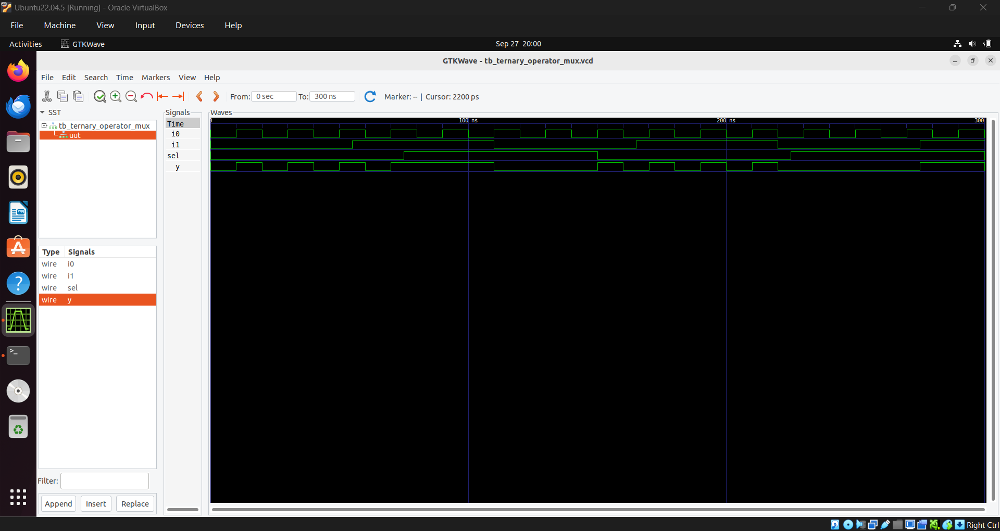

# Day 4
---
 
## 1. Gate level simulation
 - Running the testbench with Netlist as Design Under Test.
 - Testbench used for RTL code can be used here.

### Why GLS
 - Want to verify logical correctness of the design after synthesis.
 - Ensuring the design meets timing requirments.
   - For this GLS needs to be run with timing annotation.
  
### GLS using iverilog


This is same as running testbenches for RTL design, except:

 - Here the DUT will be the generated netlist.
 - We have to specify the standard cells to the iverilog simulator.

---

## 2. Synthesis Simulation Mismatch

### - Missing Sensitivity list 

 - Simulation takes into account the sensitivity list, but it may be missed during synthesis. This can cause mismatch

### Blocking vs Non-Blocking assignments

 - Happens inside ```always``` block.
 - ```=``` : Blocking assignment:
   - If the always block contains these statements, the inside of the always block will be executed line by line or sequentially.
   - One statement "blocks" the execution of the below statement.

 -```<=``` : Non-Blocking assignmnet:
   - Execute all of the RHS when entering always block and assign it to RHS.
   - Parellel execution.

### Use Non-Blocking statement (<=) in sequential logic.

---

## 3. GLS Lab

### 1. Ternary Operator MUX

```verilog
module ternary_operator_mux (input i0 , input i1 , input sel , output y);
	assign y = sel?i1:i0;
	endmodule
```
Working:
  - If  ```sel``` is high output ```y``` takes the value of input ```i0``` else it takes the value of ```i1```.

#### Simulation of RTL using iverilog:



#### Synthesis using Yosys
 Netlist generated:


#### GLS using iverilog:

```
$ iverilog ../my_lib/verilog_model/primitives.v ../my_lib/verilog_model/sky130_fd_sc_hd.v ternary_operator_mux_net.v tb_ternary_operator_mux.v

```

 
---

### 2. Bad MUX example

```verilog
module bad_mux (input i0 , input i1 , input sel , output reg y);
always @ (sel)
begin
	if(sel)
		y <= i1;
	else 
		y <= i0;
end
endmodule
```

Working:
  - Here the simulation of RTL design gives a waveform which shows a Flip-Flop behaviour, because of the ```always @ (sel)``` part.

#### Simulation of RTL using iverilog:


The output changes only when there is activity in ```sel``` input. This is flop type behaviour.

#### Synthesis using Yosys
 Netlist generated:


 - In the netlist a mux has been instantiated.

#### GLS using iverilog:

```
$ iverilog ../my_lib/verilog_model/primitives.v ../my_lib/verilog_model/sky130_fd_sc_hd.v bad_mux_net.v tb_bad_mux.v

```

 
It can be seen that synthesis version of the above design is a combinatorial circuit (here it is a mux).

### 3. Blocking assignment Caveat
