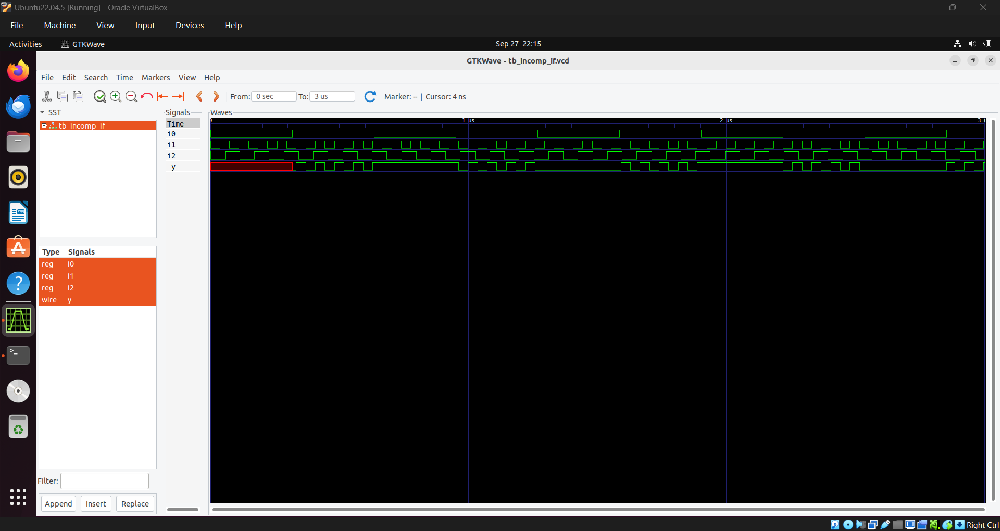
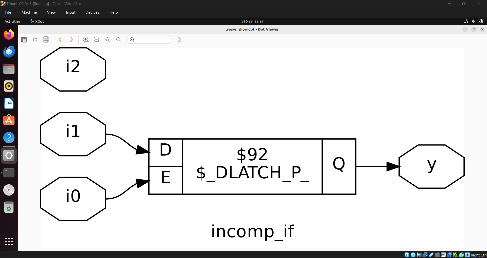
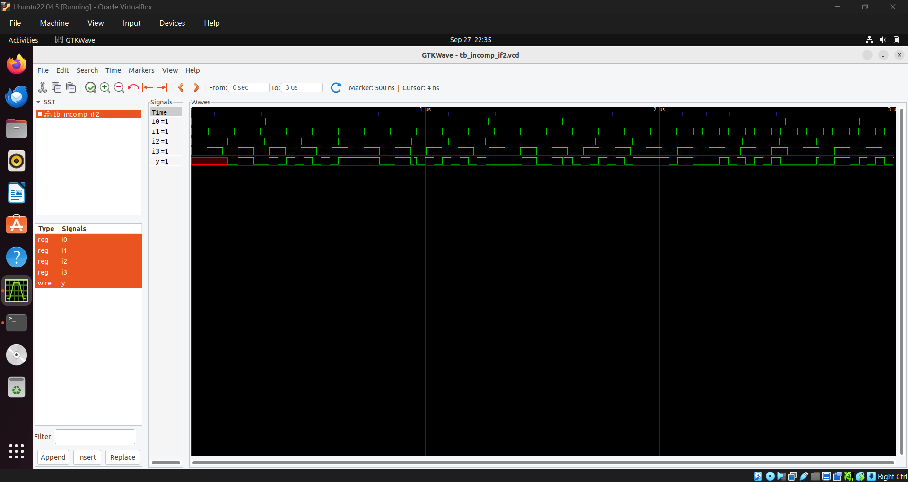
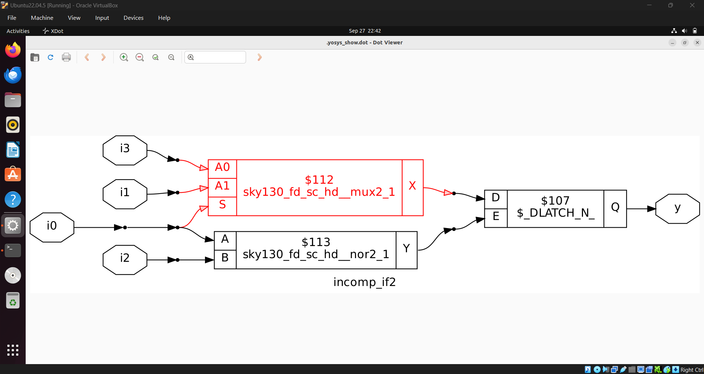
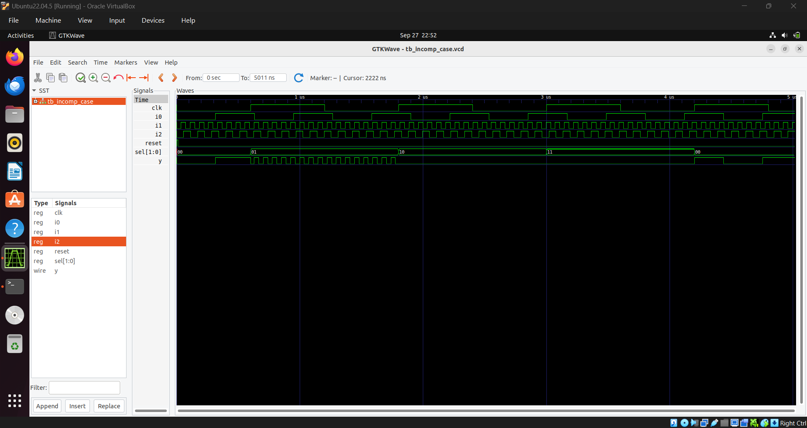
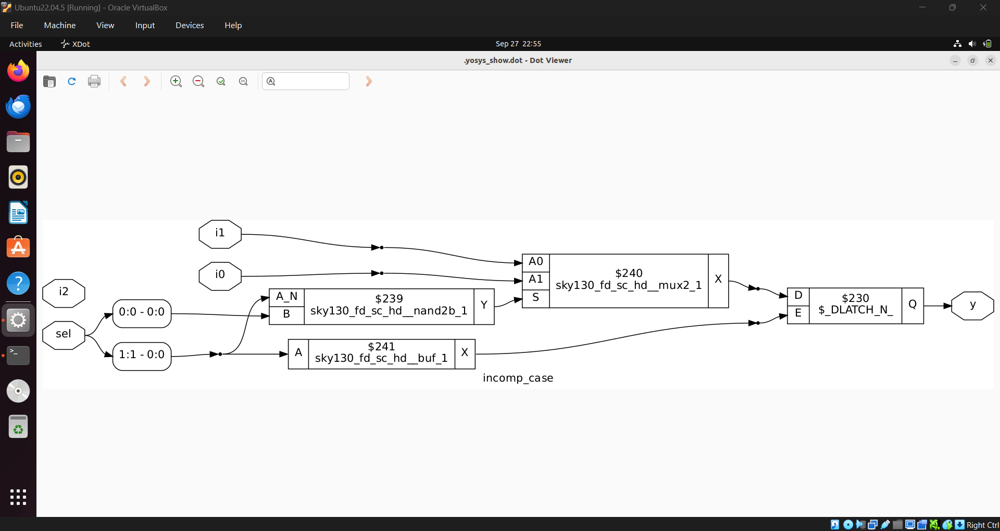
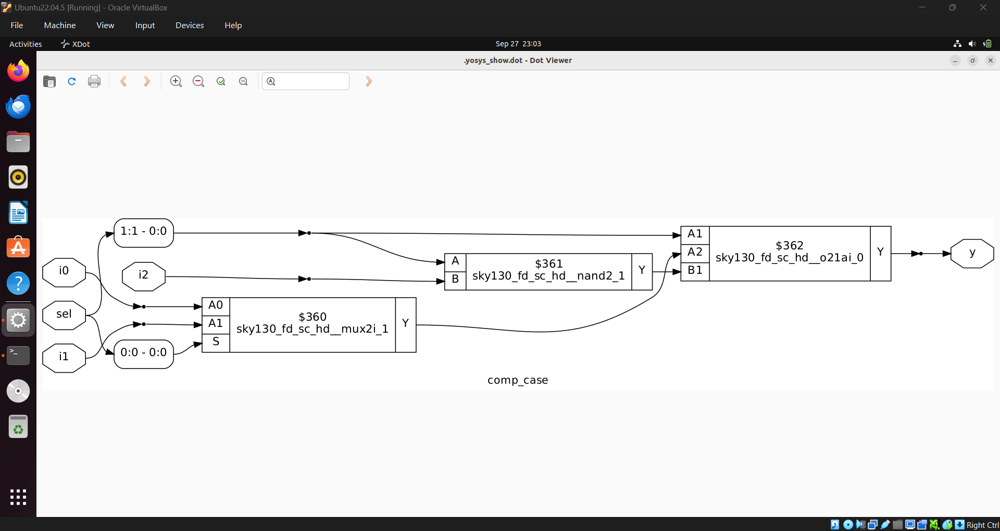
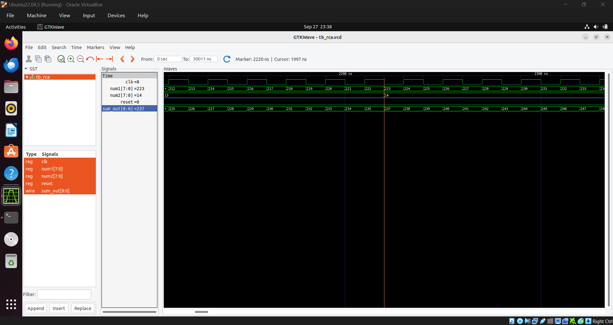

# Day 5
---
 
## 1. If-Else statement in verilog
 - Used to implement conditional statements.

### Syntax
```verilog
if (condition) begin
    // Code block executed if condition is true
end else begin
    // Code block executed if condition is false
end
```
 - "condition" in the above syntax will be a logical expression that evaluates to 1(true) or 0(false).
 - ```begin``` ```end``` is used when there are multiple statements.

### Nested if - else statement
```verilog
if (condition1) begin
    // Code for condition1 true
end
else if (condition2) begin
    // Code for condition2 true
end
else begin
    // Code if no conditions are true
end
```
 - Here the condition1 will be evaluated with highest priority, followed by condition2 and condition3.
  
## 2. Inferred Latch
 - This arrives in the design due to bad coding style.
 - Inferred latches are to be avoided from the design.
 - Happens when there are incomplete if-else statement. If sometimes the output for the else condition is not defined then the a latch will be inferred during synthesis, which holds the previous value.

```verilog
always @(*) begin
 if (condition1) begin
    // code for condition1
 end
end
```
  - Here the else condition is not defined. This can infer a latch.

### To avoid inferred latches:
  - In case of using if else statement, define the else statement properly.
  - If there is a case structure, the define each case properly and add ```default : //code for default case``` before ending the case structure.
  - Partial assignment: If there are two variable getting values, define values of both variables in each cases, even if the default is defined for both variables.


## 3. Labs for if-else and Case statements

### 1. Incomplete If

```verilog
module incomp_if (input i0 , input i1 , input i2 , output reg y);
always @ (*)
begin
	if(i0)
		y <= i1;
end
endmodule
```
  - Here ```else``` conditions is not mentioned. This can infer latch.
  

#### Simulation of RTL using iverilog:

<div align="center"></div>

- Whenever ```i0``` is high, output changes according to input ```i1```, else it latches onto the last value of ```i1``` when ```i0``` was high.

#### Synthesis using Yosys
 Netlist generated:

<div align="center"></div>

Here we can see that there is a latch in the netlist.

---

### 2. Nested If statments

```verilog
module incomp_if2 (input i0 , input i1 , input i2 , input i3, output reg y);
always @ (*)
begin
	if(i0)
		y <= i1;
	else if (i2)
		y <= i3;

end
endmodule
```
 - Logic to be executed when ```i0``` and ```i2``` is low, is not mentioned here. This could infer a latch.

#### Simulation of RTL using iverilog:

<div align="center"></div>


#### Synthesis using Yosys
 Netlist generated:

<div align="center"></div>

 - Latch is inferred in the netlist.

### 3. Incomplete Case statement

```verilog
module incomp_case (input i0 , input i1 , input i2 , input [1:0] sel, output reg y);
always @ (*)
begin
	case(sel)
		2'b00 : y = i0;
		2'b01 : y = i1;
	endcase
end
endmodule
```
 - ```sel``` is a two bit input, so it can take 4 possible values. But inside the case statement only two cases are mentioned. This could infer a latch.

#### Simulation of RTL using iverilog:

<div align="center"></div>

 - The output ```y``` remains constant when ```sel``` takes values ```2'b10``` and ```2'b11```.

#### Synthesis using Yosys
 Netlist generated:

<div align="center"></div>

 - Latch is inferred in the netlist.


### 4. Complete Case statement

```verilog
module comp_case (input i0 , input i1 , input i2 , input [1:0] sel, output reg y);
always @ (*)
begin
	case(sel)
		2'b00 : y = i0;
		2'b01 : y = i1;
		default : y = i2;
	endcase
end
endmodule
```
 - ```sel``` is a two bit input, so it can take 4 possible values. Even if only two cases of ```sel``` is mentioned, the ```default``` case avoids inferring latches

#### Simulation of RTL using iverilog:

<div align="center"></div>

#### Synthesis using Yosys
 Netlist generated:

<div align="center"></div>

 - No Latch is inferred in the netlist.

## 4. For loops in verilog

For loops are used in procedural blocks such as always block to execute statements multiple times.

### Syntax
```verilog
for (initial value of i ; condition for termination ; incrementing of i) begin    // i is for loo variable
    // Statements to execute
end
```

Example 32 to 1 mux:
```verilog
    integer i;
    always @(data, sel) begin
        y = 1'b0; // Default output
        for (i = 0; i < 32; i = i + 1) begin
            if (i == sel)
                y = data[i];
        end
    end
```

## 5. Generate For loop 

 - When there is situations where we need to instantiate hardware multiple number of times, Generate for loop can be used.
 - used outside always block.

### Syntax
```verilog
genvar i;
generate
    for (initial value of i ; condition for termination ; incrementing of i) begin : gen_loop
        // module to be instantiated multiple number of times
    end
endgenerate
```

 - The ```i``` can be used as parameters to each of the instantiated modules.

### Ripple Carry Adder

<div align="center"></div>
 - Generate for loop can be used to instantiate the multiple adder in this case.

## 6. Labs on For loop and Generate For loop

### 4 to 1 mux using for loop
```verilog
module mux_generate (input i0 , input i1, input i2 , input i3 , input [1:0] sel  , output reg y);
wire [3:0] i_int;
assign i_int = {i3,i2,i1,i0};
integer k;
always @ (*)
begin
for(k = 0; k < 4; k=k+1) begin
	if(k == sel)
		y = i_int[k];
end
end
endmodule
```

#### Simulation of RTL using iverilog:

<div align="center"></div>

### Ripple carry adder with Generate For loop

### Top module of Ripple Carry Adder
```verilog
module rca (input [7:0] num1 , input [7:0] num2 , output [8:0] sum);
wire [7:0] int_sum;
wire [7:0]int_co;

genvar i;
generate
	for (i = 1 ; i < 8; i=i+1) begin
		fa u_fa_1 (.a(num1[i]),.b(num2[i]),.c(int_co[i-1]),.co(int_co[i]),.sum(int_sum[i]));
	end

endgenerate
fa u_fa_0 (.a(num1[0]),.b(num2[0]),.c(1'b0),.co(int_co[0]),.sum(int_sum[0]));


assign sum[7:0] = int_sum;
assign sum[8] = int_co[7];
endmodule

```
Here 8 instances of Full adder are instantiated using Generate For loop

### Full adder
```verilog
module fa (input a, input b, input c, output co, output sum);
    assign {co, sum} = a + b + c;
endmodule
```

#### Simulation of RTL using iverilog:

<div align="center"></div>

